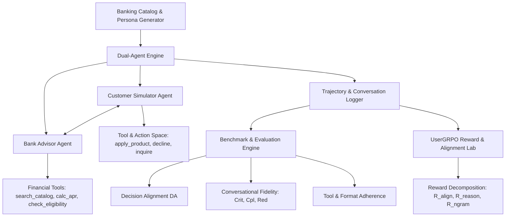

# CustomerSim (Retail Banking) Web Application — Development Plan

An end-to-end implementation plan for adapting the research paper [CustomerSim: Benchmarking and Aligning Multimodal Language Models as Retail User Simulators (arXiv:2605.08334)](https://arxiv.org/html/2605.08334v2) into an interactive, enterprise-grade web application for **Retail Banking User Simulation and Alignment**, styled with the design language and UX philosophy of **Frase.io**.

---

## 1. Domain & Paper Adaptation: Retail Shopping → Retail Banking

| Paper Dimension (Shopping) | Retail Banking Adaptation (CustomerSim Banking) |
| :--- | :--- |
| **Product Inventory (468 items across 5 categories)** | **Curated Banking Catalog (8 categories, 60+ structured financial products)**:<br>• Checking / Everyday Accounts<br>• High-Yield Savings & CDs<br>• Residential Mortgages & Refinancing<br>• Credit Cards (Cashback, Travel, Low-APR, Secured)<br>• Personal & Auto Loans<br>• Wealth & Micro-Investing Portfolios<br>• Small Business Lines of Credit & Overdrafts |
| **Persona Construction (360 profiles)** | **Financial Personas (300+ profiles + dynamic generator)**:<br>• Demographics (Age, Income, Credit Tier, Employment, Life Stage)<br>• Financial Position (Liquid assets, Debt-to-income ratio, Risk profile)<br>• Explicit Criteria (e.g., "0% intro APR > 15 mo", "APY > 4.8%", "No monthly fee")<br>• Implicit / Latent Dealbreakers (e.g., "Branch requirement within 5 mi", "Refuses predatory interest rates", "Ethical/Green ESG certified")<br>• Infeasible edge-case personas to evaluate abstention/rejection |
| **Dual-Agent Action Space** | **Tool-augmented dual-agent system**:<br>• **Customer Actions (Terminal & In-turn)**: `inquire_details`, `compare_offers`, `apply_for_product`, `open_account`, `decline_and_exit`, `escalate_to_human`<br>• **Bank Advisor Actions (Tools)**: `lookup_banking_guide`, `search_financial_products`, `calculate_amortization_and_apr`, `check_eligibility_tier`, `compare_card_perks` |
| **Metrics Suite** | **Benchmark Evaluation Engine**:<br>• **Decision Alignment (DA)**: Precision, Recall, F1, and alignment rate ($a(\mathcal{C}) \in \mathcal{A}$ vs correct rejection $\varnothing$)<br>• **Conversational Fidelity**: First-turn criteria count (Crit.), Sentence Completeness (%Cpl.), Lexical Redundancy (TF-IDF Red.), Persuasion Drift Rate<br>• **Tool Quality**: Formatting Error Rate (Fmt.), Premature Termination Rate (End.) |
| **UserGRPO RL & Alignment** | **Interactive Alignment & Reward Lab**:<br>• Trajectory-level reward calculation ($R_{\text{align}}$, $R_{\text{reason}}$, $R_{\text{ngram}}$, $R_{\text{format}}$, $R_{\text{length}}$)<br>• Visualizing baseline vs SFT vs UserGRPO vs Stylistic Steering performance gaps |

---

## 2. UI & Design System: Frase.io Aesthetic

The interface will meticulously adopt the visual language and interactive cues of **Frase.io**:
- **Color Tokens**:
  - Forest Green Core: `#059469` (Primary action), `#0D5C3A` (Deep Forest), `#ECFDF5` (Forest 50 tint)
  - Dark Slate Ink: `#121A15` / `#1F2937` (Text primary and high-contrast badges)
  - Warm Amber / Opportunity Gold: `#D9890F` / `#985908` (Opportunity badges and highlight states)
  - Surface Palette: Elevated white cards (`bg-white`), sunken slate background (`#F9FAFB` / `#F3F4F6`), crisp subtle border lines (`#E5E7EB`)
- **Typography & Details**:
  - Micro Monospace tracking labels: `font-mono text-xs uppercase tracking-[0.14em]`
  - Refined Display Headings with editorial serif/modern sans balance
  - Crisp definition lists (`<dl>`, `<dt>`, `<dd>`) for persona breakdowns and metrics
  - Multi-stage navigation bar mimicking Frase's signature workflow tab bar: `1. Catalog & Personas` → `2. Dual-Agent Live Arena` → `3. Batch Benchmark` → `4. UserGRPO Alignment Lab` → `5. Comparative Analytics`

---

## 3. Core Architecture & Feature Modules



### Module 1: Banking Inventory & Persona Registry (`/catalog`, `/personas`)
- Interactive Explorer for banking products (Accounts, Cards, Mortgages, Loans, Portfolios) with ground-truth attribute schemas.
- Persona builder with demographic sliders, financial stress parameters, explicit wishes, and hidden dealbreakers.
- Infeasible Scenario Flag: Generate personas designed to test whether the simulator correctly rejects unsuitable products.

### Module 2: Dual-Agent Live Interactive Arena (`/arena`)
- Live turn-by-turn conversational simulation between Customer Simulator and Bank Advisor.
- Persona Inspector Sidebar: Shows latent goals, tolerance levels, and real-time persuasion drift meter.
- Simulator "Inner Monologue / Reasoning Trace" toggle showing how the persona evaluates bank offers.
- Interactive mode: User can take over either the Customer or the Bank Advisor at any turn.
- Model selector: Baseline LLM vs Prompt-Steered vs SFT vs UserGRPO-aligned simulator.

### Module 3: Batch Benchmark & Experiment Matrix (`/benchmark`)
- Execute automated multi-turn rollouts across 50, 100, or 300 persona-product scenarios.
- Live progress dashboard tracking rollout runs across financial categories.
- Real-time aggregation of Decision Alignment (DA), Early Exits (End.), Formatting Errors (Fmt.), and First-Turn Criteria Dump (Crit.).

### Module 4: UserGRPO Alignment & Trajectory Lab (`/usergrpo`)
- Visualizes trajectory-level reinforcement learning mechanics.
- Detailed step-by-step reward attribution breakdown for any simulation trajectory:
  - $R_{\text{align}}$ (Decision correctness)
  - $R_{\text{reason}}$ (LLM Judge Persona Coherence score)
  - $R_{\text{ngram}}$ (Lexical naturalness vs rigid AI output)
  - Auxiliary format and length penalties
- Interactive Policy Comparison: Compare side-by-side transcripts of Baseline vs SFT vs UserGRPO on the same persona.

### Module 5: Analytics & Insights Dashboard (`/analytics`)
- Category-wise performance charts (Mortgages vs Cards vs Savings).
- Persuasion susceptibility matrix (e.g. how often high-interest loans are mistakenly accepted due to persuasive advisor tone).
- Exportable benchmark reports (JSON / CSV).

---

## 4. Technology Stack & Implementation Structure

- **Framework**: Next.js 14+ (App Router) / React / TypeScript
- **Styling**: Tailwind CSS configured with Frase.io design tokens + Lucide React Icons
- **State Management & Simulation Engine**: Client-side reactive simulation engine with built-in realistic LLM persona generators & banking advisor heuristics + configurable BYO-API endpoint (Gemini, Claude, OpenAI, Local Ollama)
- **Charts & Visualizations**: Recharts / Tremor-style charts for alignment scores, reward trajectories, and lexical distributions

### Proposed Directory Layout
```
customer_sim/
├── src/
│   ├── app/
│   │   ├── layout.tsx                # App shell, Frase header, global navigation
│   │   ├── page.tsx                  # Landing & Platform Overview
│   │   ├── arena/page.tsx            # Dual-Agent Live Simulation Arena
│   │   ├── catalog/page.tsx          # Banking Catalog & Product Registry
│   │   ├── personas/page.tsx         # Persona Builder & Ground Truth Matrix
│   │   ├── benchmark/page.tsx        # Batch Benchmark Runner & Matrix
│   │   ├── usergrpo/page.tsx         # UserGRPO Alignment & Reward Inspector
│   │   └── analytics/page.tsx        # Insights & Persuasion Analytics
│   ├── components/
│   │   ├── common/                   # Frase-style Header, Badges, Tabs, Buttons
│   │   ├── arena/                    # ChatFeed, PersonaDrawer, MonologueTrace, ToolDrawer
│   │   ├── catalog/                  # ProductCard, FilterDrawer, ComparisonModal
│   │   ├── benchmark/                # MetricCards, RolloutTable, ConfusionMatrix
│   │   └── usergrpo/                 # RewardBreakdownChart, PolicyComparisonView
│   ├── data/
│   │   ├── banking_catalog.json      # Rich dataset of 60+ retail banking products
│   │   ├── seed_personas.json        # 50+ curated persona profiles with dealbreakers
│   │   └── benchmark_fixtures.json   # Precomputed evaluation rollouts across backbones
│   ├── lib/
│   │   ├── simulation/               # Dual-agent simulator loop & action handlers
│   │   ├── evaluation/               # DA, Crit, Cpl, TF-IDF redundancy calculations
│   │   ├── rewards/                  # UserGRPO trajectory reward evaluators
│   │   └── types.ts                  # TypeScript interfaces for Personas, Products, Turns
│   └── styles/
│       └── globals.css               # Frase typography, variables, scrollbar styling
├── tailwind.config.ts
├── package.json
└── tsconfig.json
```

---

## 5. Phased Implementation Roadmap

1. **Phase 1: Project Scaffolding & Design System**:
   - Initialize Next.js TypeScript app with Tailwind CSS and Frase design tokens (forest greens, mono tracking labels, elevated surfaces).
   - Build responsive Frase-style navigation header, stage selector, and metric card primitives.
2. **Phase 2: Banking Data Models & Persona Engine**:
   - Create comprehensive financial catalog (`banking_catalog.json`) across 8 retail banking domains.
   - Build persona generation engine (`seed_personas.json`) with demographic and dealbreaker constraints.
   - Implement ground-truth acceptability resolver ($a(\mathcal{C}) \in \mathcal{A}$).
3. **Phase 3: Dual-Agent Simulation Engine**:
   - Implement Customer Simulator agent and Bank Advisor agent with action space (`apply_product`, `decline`, `inquire`, `lookup_banking_guide`, `calc_apr`).
   - Create interactive Live Arena with real-time streaming, inner reasoning display, and persuasion meter.
4. **Phase 4: Benchmark & Evaluation Suite**:
   - Build the automated benchmark runner calculating Decision Alignment (DA), Criteria Count (Crit.), Sentence Completeness (%Cpl.), and Redundancy (Red.).
   - Interactive matrix comparing Model Baselines (Base LLM, Human-Steered, SFT, UserGRPO).
5. **Phase 5: UserGRPO Alignment Lab & Analytics**:
   - Build the trajectory-level reward calculator ($R_{\text{align}}$, $R_{\text{reason}}$, $R_{\text{ngram}}$, length penalties).
   - Side-by-side transcript comparison tool demonstrating alignment gains and persuasion resistance.
6. **Phase 6: Verification & Polish**:
   - Validate live simulations, metric computations, responsive design, and keyboard accessibility.

---

## Verification Plan

### Automated Checks
- `npm run build`: Verify zero TypeScript errors and successful production build.
- `npm run lint`: Verify code style and formatting standards.
- Benchmark validation script: Run automated persona tests to verify $R_{\text{align}}$ and $DA$ metric calculations match the paper's formula.

### Manual UI/UX Verification
- Test interactive dual-agent conversation in the Arena with different personas (student, mortgage seeker, retiree).
- Verify tool execution displays in real-time (e.g. loan repayment calculations).
- Verify Frase.io design aesthetics: Forest green accents, monospace tags, clean cards, definition lists, and typography.
